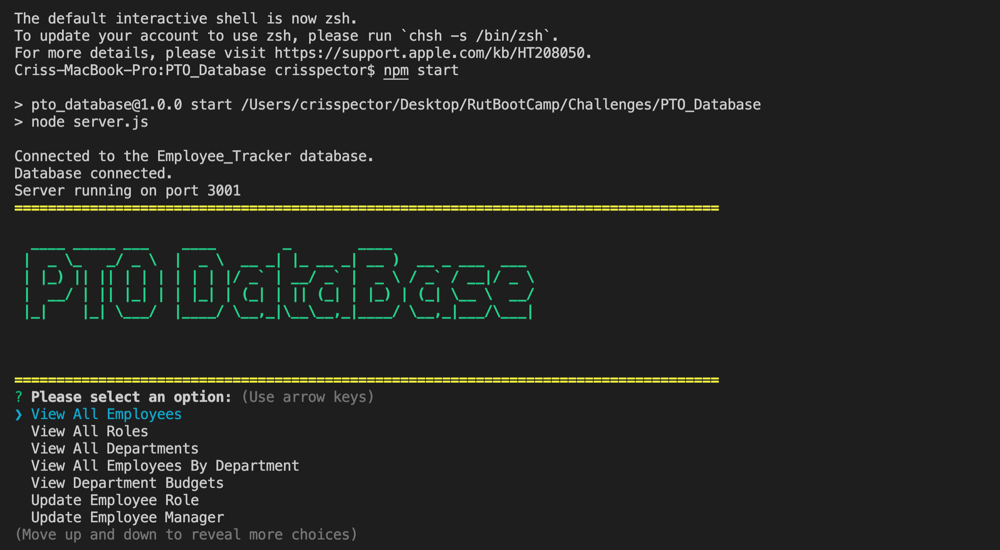

  # PTO_Database
  

  ## Description 
    * A command-line application to manage a company's employee database, using Node.js, Inquirer, and MySQL.
  ## Table of Contents (Optional)
  
  * [Installation](#installation)
  * [Usage](#usage)
  * [Credits](#credits)
  * [License](#license)

  ## Installation
    * To install: download from github, enter "npm start" in the command line.
    * Video Demo: https://youtu.be/gnf39kV5KH0
  
  ## Usage 
    * Use this program by: use it how you want.
  
  
  
  
  ## Credits
   * The following folks helped with this project: Me, myself, and I
  
  ## License
   * This project uses this license: https://opensource.org/licenses/MIT
  
  ## Badges
  
  * 
  
  ## Features
    * The project has the following features: JavaScript, Node, Express.js, SQL
  
  ## Contributing
    * If you'd contribute to this project, consider the following: contribute if you want. 
  ## Tests
    *N/A

  ## Questions?
  * Reach out to the repository owner spectocr, https://github.com/spectocr/PTO_Database, or email at cris.spector@live.com

